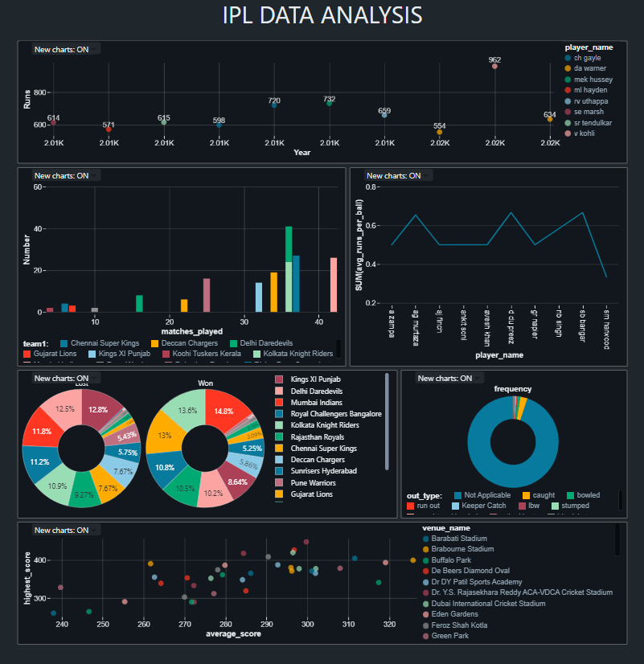

# Data Analysis using Databricks & PySpark

## Overview
This project showcases the use of **PySpark** within **Azure Databricks** to conduct scalable data analysis on structured cricket datasets. It involves reading data from multiple formats, applying transformations, executing SQL-like operations, and generating insights. The infrastructure is built using **Azure Databricks** for distributed computing and **Azure Blob Storage** to store datasets such as `ball_by_ball`, `match`, `player`, and more.

---

### Cloud Infrastructure Highlights

- **Azure Databricks**:
  - Provides a collaborative, notebook-based environment.
  - Supports parallel processing with Apache Spark for large-scale data workloads.

- **Azure Blob Storage**:
  - Ensures reliable and scalable data storage.
  - Used as the primary source for loading raw cricket data.

---

## Key Functionalities

- **Data Ingestion**:
  - Load CSV, JSON, and Parquet files into Spark DataFrames.
  - Read data directly from Azure Blob Storage.

- **Data Transformation**:
  - Apply filters, aggregations, and column manipulations.
  - Use temporary views to run Spark SQL for flexible querying.

- **Exploratory Analysis**:
  - Perform EDA to uncover trends and patterns.
  - Use window functions and analytical operations.

- **Data Merging**:
  - Join multiple datasets (`ball_by_ball`, `match`, `team`, etc.) for enriched context.

- **Visualization**:
  - Leverage built-in visualization tools in Databricks notebooks.
  - Generate charts and plots for interactive insights.

---

## Dataset Description

The analysis is based on real-world cricket data. Main datasets include:

- **Ball-by-Ball**: Every delivery is logged with attributes like `match_id`, `team_batting`, `runs_scored`, `extras`.
- **Match Info**: Metadata including `match_id`, `teams`, `date`, and `season_year`.
- **Players**: Player-level information (`player_id`, `batting_hand`, `bowling_skill`).
- **Teams**: Mapping of `team_id` to `team_name`.
- **Player-Match**: Association of players to matches, including awards like `is_manofthematch`.

---

## Setup Instructions

### Requirements

- An active **Azure Databricks** workspace.
- **Python 3.8+**
- Cluster with **Apache Spark** and **PySpark** installed.

### How to Run

1. Upload the datasets to DBFS or mount your Azure Blob Storage to `/mnt/cricket/`.
2. Open the Databricks notebook (`cricket_data_analysis.py`) under the `notebooks/` directory.
3. Run each cell to load, transform, and analyze the data.
4. Use `display()` functions in Databricks to visualize the output.

---

## Sample Dashboard Output

---

## Author

**SAHIL RAJ**  
[GitHub Profile](https://github.com/Sahil28517)  

---

## License

This project is licensed under the MIT License - see the [LICENSE](LICENSE) file for details.

